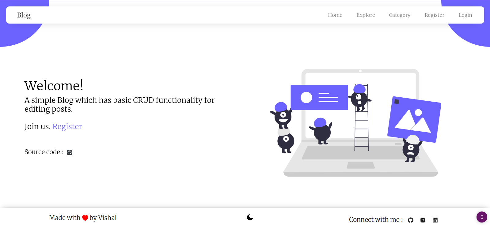

# Django-React-Blog

This is a simple "Blogging platform" with basic CRUD functionalities.

This is designed by using Django as backend, Reactjs as frontend and Postgresql for the Database part.

Feel free to open a pull request or use this project.


---

## Features

- Login/Registration
- Simple Design
- Dark Theme
- Create/Read/Update/Delete Post
- Read Categories
- Add/Read comments
- User Profile

---

## Setup

Make sure you have python, pipenv and npm or yarn already installed

1. Clone this repository : `git clone https://github.com/VDA-001/blog-django-react.git`
2. Move into the directory: `cd blog-django-react`
3. Create a `.env` and add the following line's to it and give them a unique value.
   > Note: The default database is dbsqlite3, so giving values to below specified DATABASE\_\* is optional but is 'required' if you are using postgresql and to use postgresql just uncomment the DATABASE part in `blog-django-react/blog_backend/settings.py` and comment/remove the default one.

```
SECRET_KEY=<Add a secret key which is unique>
DATABASE_PASSWORD=<Your database password>
DATABASE_NAME=<Your database name>
DATABASE_USER=<Your database username>
```

4. Create a virtualenv and install all backend dependencies: `pipenv install`.
5. Start the virtualenv: `pipenv shell`.
6. Run `python manage.py makemigrations`.
7. Run `python manage.py migrate`.
   > Note: Make sure to make changes to name, email, username, password at `blog-django-react/api/migrations/0001_initial.py`, which serves as superuser credentials.
8. Change current directory to ./blog_frontend: `cd blog_frontend`
9. Install all frontend dependencies: `yarn install`
10. Build the frontend: `yarn build`.
11. Move back to the root directory: `cd ..`
12. Run the server: `python manage.py runserver`.

---

## Screenshots





